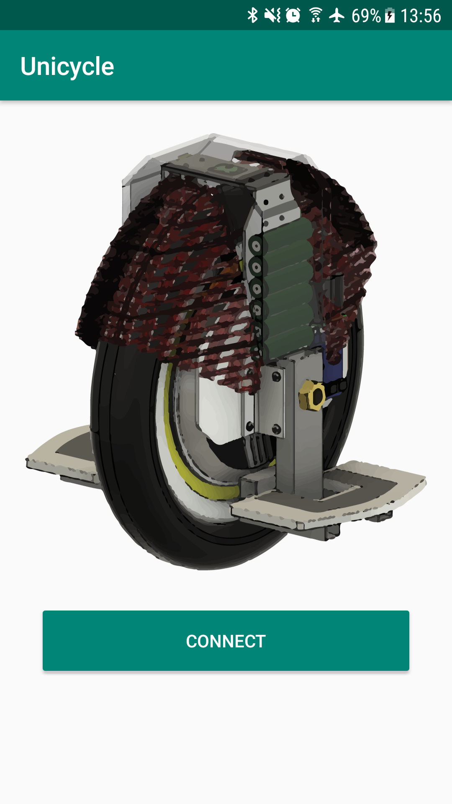
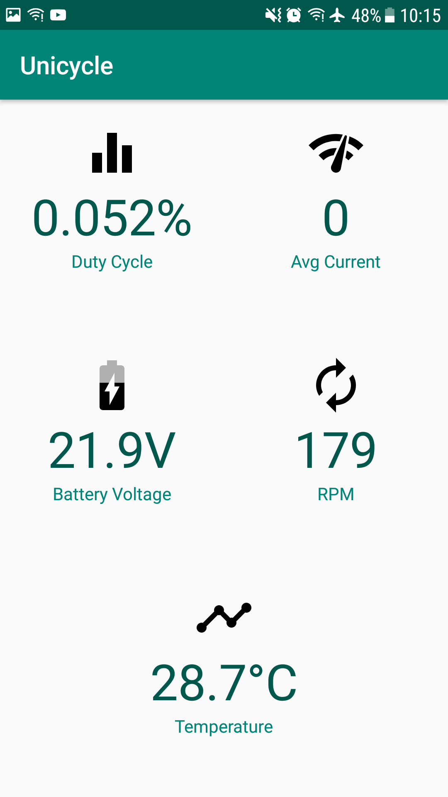

# UniWheel-Android-App 
This is the repository for the Android App for the Uniwheel Project 
## Software Information
* Android 6.0 +
* Made with `Android Studio 3.4.2`
* Gradle Version : `gradle:3.4.0`

## App Features 
* Connect to the UniWheel over wifi to track the following vehicle essentials:
  * Battery Information
  * Motor Average Current Consumption 
  * Other vital information
## Screenshots 
            
